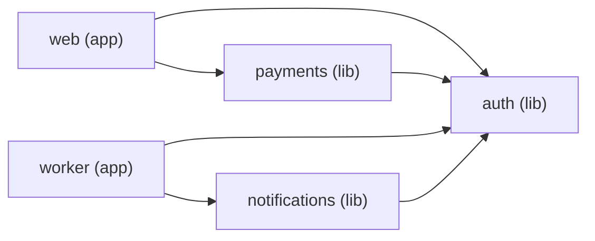

# rwm-test

Demo workspace for [Ruby Workspace Manager (rwm)](https://github.com/sidbhatt11/ruby-workspace-manager).

This is a fake monorepo with 3 shared libraries and 2 minimal Rails apps, wired together with rwm to demonstrate dependency graphing, parallel test execution, task caching, affected detection, and convention checking.

## Dependency graph



```
Name           Type  Path                Dependencies
-------------  ----  ------------------  ------------
auth           lib   libs/auth           (none)
notifications  lib   libs/notifications  auth
payments       lib   libs/payments       auth
web            app   apps/web            auth, payments
worker         app   apps/worker         auth, notifications
```

## Packages

### libs/auth (9 specs)

Foundational library. Token generation/verification (HMAC-SHA256, JWT-like) and an in-memory user store with password hashing. No dependencies on other workspace packages.

- `Auth::Token.generate(payload)` / `Auth::Token.verify(token)`
- `Auth::User.register(email:, name:, password:)` / `.find_by_email` / `.find_by_id`
- `Auth.authenticate(email, password)` — returns a token or nil

### libs/payments (6 specs) — depends on auth

Charge processing and receipt generation. Uses `Auth::User` to look up users by ID.

- `Payments::Charge.new(user_id:, amount_cents:, currency:)` / `#process!` / `#amount_display`
- `Payments::Receipt.new(charge)` / `#to_s` — generates a formatted receipt

### libs/notifications (6 specs) — depends on auth

Message creation and dispatch. Uses `Auth::User` to resolve user IDs to email addresses.

- `Notifications::Message.new(to:, subject:, body:, channel:)` — channels: `:email`, `:sms`, `:in_app`
- `Notifications::Dispatcher#deliver(message)` / `#deliver_to_user(user_id, ...)` / `#summary`

### apps/web (5 specs) — depends on auth, payments

Minimal Rails 8.1 API app. Three endpoints:

- `GET /health` — returns `{ status: "ok", version: "0.1.0" }`
- `POST /sessions` — authenticates via `Auth.authenticate`, returns a token
- `POST /charges` — creates a charge via `Payments::Charge`, returns a receipt

Has a `demo:seed` rake task that creates two users and processes a sample $42.00 AUD charge.

### apps/worker (3 specs) — depends on auth, notifications

Minimal Rails 8.1 app simulating a background worker. Has a `NotificationJob` model that dispatches welcome emails, payment confirmations, and in-app alerts via `Notifications::Dispatcher`.

Has a `demo:seed` rake task that creates two users and dispatches 3 notifications.

## RWM commands to demo

All commands run from the workspace root.

```bash
# See packages and their dependencies
rwm list
rwm graph --mermaid

# Validate conventions (no lib→app deps, no app→app deps, no cycles)
rwm check

# Run all specs in parallel (DAG-scheduled, concurrency = CPU count)
rwm spec

# Run again — everything is cached, nothing re-runs
rwm spec

# Clear cache and run fresh
rwm cache clean
rwm spec

# Touch a file in auth, see what's affected
echo "" >> libs/auth/lib/auth/token.rb
rwm affected
# → auth (changed), payments (dependent), notifications (dependent),
#   web (dependent), worker (dependent)

# Run only affected specs
rwm spec --affected

# Touch a file in payments instead — smaller blast radius
git checkout -- libs/auth/lib/auth/token.rb
echo "" >> libs/payments/lib/payments/charge.rb
rwm affected
# → payments (changed), web (dependent)
# notifications and worker are unaffected

# Run the seed tasks inside the Rails apps
cd apps/web && bin/rails demo:seed
cd apps/worker && bin/rails demo:seed
```

## Setup

Requires Ruby 3.2+ and the `rwm` gem installed (`gem install ruby_workspace_manager`).

```bash
git clone <this-repo>
cd rwm-test
rwm bootstrap
```

This runs `bundle install` across all 5 packages (in parallel, respecting dependency order), installs git hooks, builds the dependency graph, and validates conventions.

## Known issues found while building this

- [#1](https://github.com/sidbhatt11/ruby-workspace-manager/issues/1) — `cacheable_task` doesn't support Rake dependency syntax (`seed: :environment` raises ArgumentError)
- [#2](https://github.com/sidbhatt11/ruby-workspace-manager/issues/2) — `cacheable_task` stacks on existing Rake tasks instead of replacing (specs run twice in Rails apps with rspec-rails)
- [#3](https://github.com/sidbhatt11/ruby-workspace-manager/issues/3) — Default `rwm graph` output shows all packages as `app/` (symbol vs string comparison bug)
